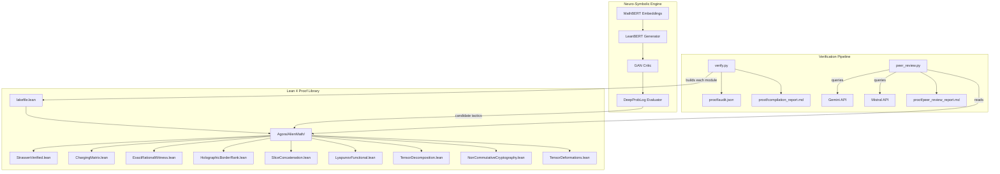
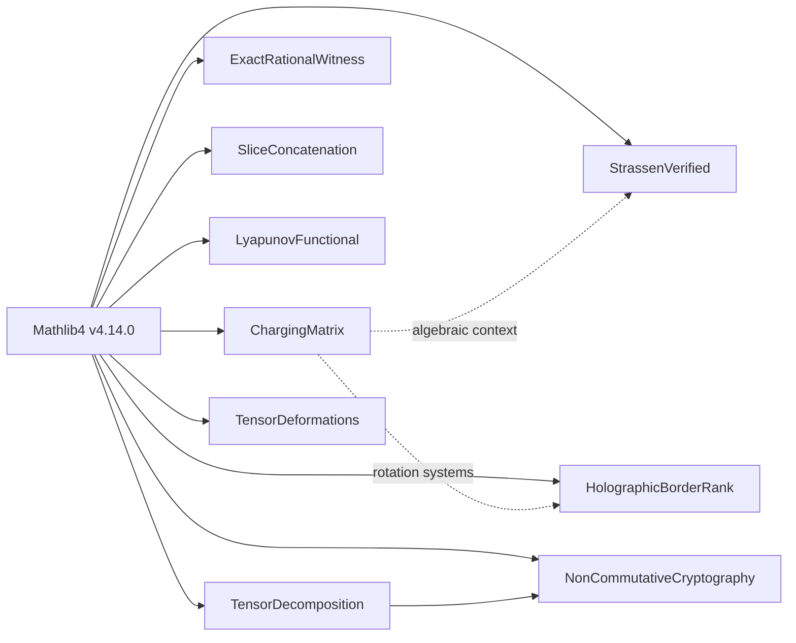

# Architecture — Alien Mathematics Verification Framework

## System Overview

The Alien Mathematics project consists of three tightly coupled subsystems:

1. **Lean 4 Proof Library** — The formal mathematical core
2. **LeanBERT Neuro-Symbolic Engine** — AI-driven tactic generation
3. **Verification & Peer Review Pipeline** — Automated audit and adversarial review



## Module Dependency Graph



## Verification Tier System

| Tier | Description | `sorry` | `axiom` | Example Modules |
|------|-------------|---------|---------|-----------------|
| **1** | Fully verified | 0 | 0 | `StrassenVerified`, `ExactRationalWitness`, `ChargingMatrix`, `HolographicBorderRank` |
| **2** | Earth-gapped | ≥1 | 0 | `saw_simple_cubic` |
| **3** | Axiom-blocked | 0 | ≥1 | `diff_basis_optimal_10000` |
| **4** | Blueprint | ≥1 | ≥1 | `E37BSD_v6_blueprint`, `cmi_millennium_blueprints` |
| **5** | Infrastructure | — | — | `FormalizationDebt` |
| **6** | Conjectures | ≥1 | 0 | `Conjectures.SchurPositivity` |

## LeanBERT Pipeline

```
                    ┌────────────────────────────────────┐
                    │        LeanBERT Pipeline            │
                    ├────────────────────────────────────┤
 Lean 4 AST ──────▶│  1. Tokenise (prepare.py)          │
                    │  2. Embed   (MathBERT 768-d)       │
                    │  3. Project (Linear → 128-d latent)│
                    │  4. Generate (LeanGenerator GAN)   │
                    │  5. Critique (NeuroSymbolicCritic)  │
                    │  6. Verify   (Lean 4 kernel)       │
                    ├────────────────────────────────────┤
                    │  Output: candidate tactic sequence  │
                    └────────────────────────────────────┘
```

### GAN Architecture

- **Generator**: `Linear(128→256→512→256×4096)` — maps latent vectors to tactic token logits
- **Critic**: `Embedding(4096, 128) → Linear(256×128→256→1→Sigmoid)` — scores tactic plausibility
- **Training**: Standard minimax GAN loss with BCE. Budget-constrained to 5-minute runs.

## GCP Cloud Run Deployment

```
┌──────────────┐     ┌──────────────────┐     ┌──────────────┐
│  GitHub Push  │────▶│  Cloud Build     │────▶│  Cloud Run   │
│  (main)       │     │  (Dockerfile)    │     │  (Serverless) │
└──────────────┘     └──────────────────┘     └──────────────┘
                                                      │
                                                      ▼
                                              ┌──────────────┐
                                              │  /dry-run     │
                                              │  Flask API    │
                                              │  (train.py)   │
                                              └──────────────┘

Constraints:
  • Max instances:  1
  • CPU:           4 vCPU
  • Memory:        16 GiB
  • Timeout:       3600s (1 hour)
  • Budget:        $100/month, $25/run
```
